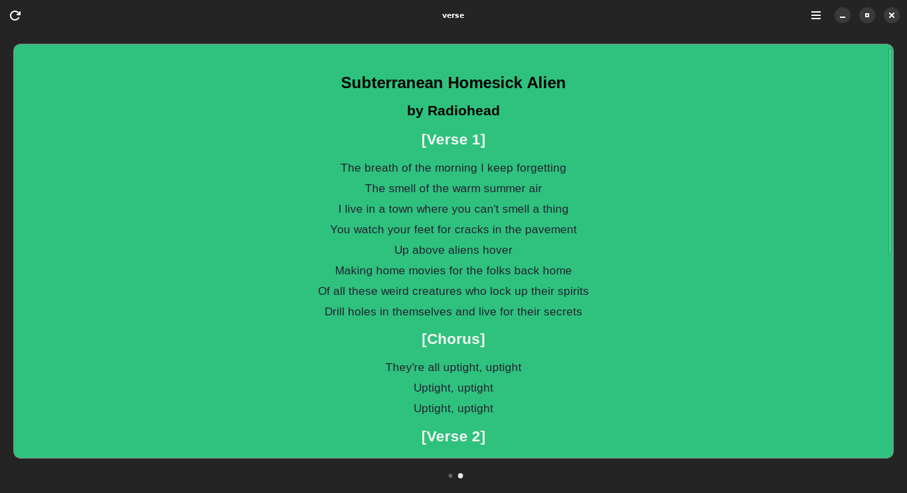

# verse

Displays the lyrics of the song currently playing on Spotify.



## Build

### Linux

Required packages for Debian, Ubuntu, Mint etc.
```
sudo apt install meson ninja-build python-setuptools libgtk-4-dev libadwaita-1-0
```

Build locally:
```
meson setup _build
meson compile -C _build
meson install -C _build
```

Build using [GNOME Builder](https://flathub.org/apps/org.gnome.Builder)

Install using `flatpak-builder`
```console
$ flatpak-builder  --force-clean _flatpak/ io.github.TanmayPatil105.verse.json  --user --install
$ flatpak run io.github.TanmayPatil105.verse.json
```

## API keys
verse requires following API keys:
1. Spotify
- CLIENT_ID
- CLIENT_SECRET
- REFRESH_TOKEN

2. Genius.com
- GENIUS TOKEN

Take a  on how to obtain API tokens.
