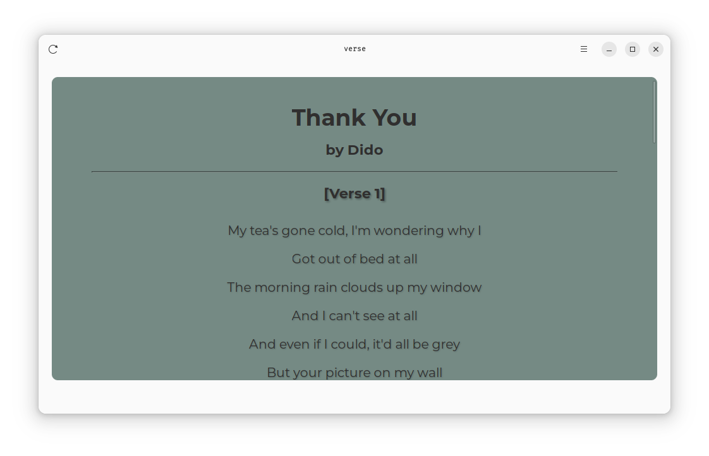
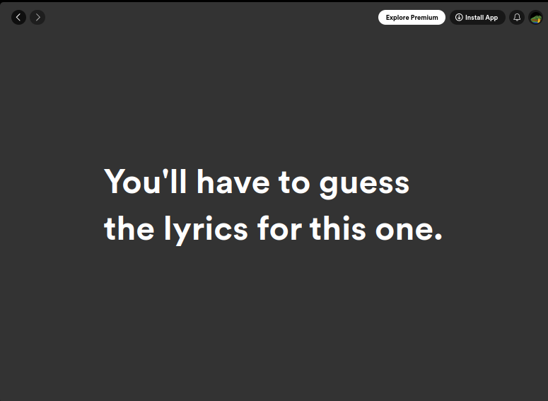
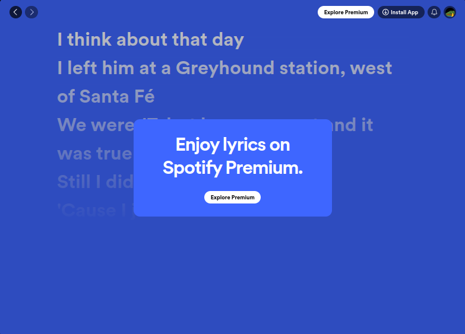

<h1 align="center">
  
  <br>
  verse
</h1>

<p align="center">
  <strong>Fetch the lyrics of the song currently playing on Spotify</strong>
</p>

<p align="center">
  <a href="https://flathub.org/apps/details/io.github.TanmayPatil105.verse">
    
  </a>
  <br>
</p>


<p align="center">
    
</p>
## License

verse is licensed under the Apache-2.0.

## Building from source

### Linux


#### Build locally:

Required packages for Debian, Ubuntu, Mint etc.
```console
sudo apt install meson ninja-build python-setuptools libgtk-4-dev libadwaita-1-0
```
```console
meson setup _build
meson compile -C _build
meson install -C _build
```

#### Build using [GNOME Builder](https://flathub.org/apps/org.gnome.Builder)

In Builder, click the "Clone Repository" button at the bottom, using `https://github.com/TanmayPatil105/verse.git` as the URL.\
Click the `Build` button at the top once the project is loaded.


#### Install using `flatpak-builder` (works on all Linux distributions)
```console
# for Debian, Ubuntu, Mint etc.
sudo apt install flatpak-builder

# Install
flatpak-builder  --force-clean _flatpak/ io.github.TanmayPatil105.verse.json  --user --install
flatpak run io.github.TanmayPatil105.verse
```

## API keys

`verse` requires Spotify and Genius.com APIs.

Take a [look](./wiki/README.md) on how to obtain the API tokens.


## Motivation
Well..



